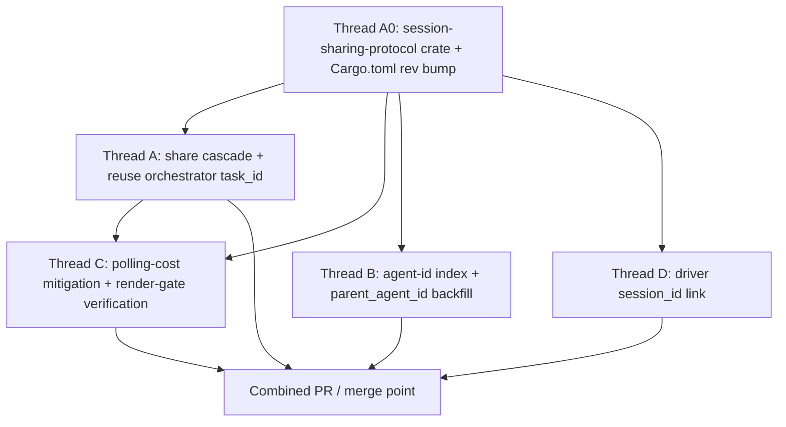

# Session Sharing for Orchestrated Agent Sessions
## Context
See `specs/QUALITY-726/PRODUCT.md` for user-visible behavior. This spec maps the product invariants onto the existing orchestration pill bar and shared-session viewer infrastructure, and fixes the gaps observed across the eight share-parent / share-child × local/remote permutations.
The orchestration pill bar in shared-session viewers was originally built for remote-remote (cloud-spawned orchestrator + cloud children) in `specs/orch-pill-bar-web/TECH.md`. That design already covers `apply_children_fetch`, per-child hidden viewer panes, REST polling, and pill click navigation. This spec extends those mechanisms to the other topologies (local-local, local-remote, remote-local, remote-remote child link) and fixes agent-name resolution in both the pill bar and conversation bodies.
### Where the pill bar currently renders
- Render gate (shared by native and viewer pill bars): `app/src/terminal/view/pane_impl.rs:503-552` (`maybe_add_parent_navigation_card`), keyed on `FeatureFlag::OrchestrationPillBar` || `FeatureFlag::OrchestrationViewerPillBar` plus `AgentView` fullscreen.
- Pill data: `app/src/ai/blocklist/agent_view/orchestration_pill_bar.rs` reads `BlocklistAIHistoryModel::descendant_conversation_ids_in_spawn_order` via `pill_specs` (`orchestration_pill_bar.rs:555-580`). `pill_specs` returns `None` when the orchestrator has no descendants; the pill bar collapses to `Empty` in that case.
- Shared-session viewer’s discovery side: `OrchestrationViewerModel` REST-polls children (`app/src/terminal/shared_session/viewer/orchestration_viewer_model.rs:1-416`). Its construction site is `app/src/terminal/shared_session/viewer/terminal_manager.rs:778-816`, currently gated on `SessionSourceType::AmbientAgent { .. }`.
### Where children are made shareable
- Remote children are always shared by the server: spawning a remote child mints an `ai_tasks` row and a `SessionSourceType::AmbientAgent { task_id }` shared session.
- Local children created from a local orchestrator inherit sharing via `inherit_share_for_local_child` in `app/src/pane_group/pane/terminal_pane.rs:228-248`, **but only when the host terminal’s `SessionSourceType` is `AmbientAgent`**. Manual local shares (created via the share modal at `app/src/terminal/view/shared_session/view_impl.rs:1864-1890`) do not get an `AmbientAgent` source, so they fail this gate and children stay unshared.
- After QUALITY-726, the host’s orchestrator `task_id` rides on a sibling `source_task_id` field, not on the `SessionSourceType::User` variant itself — see *Sidecar source_task_id design* below.
### Where agent IDs are resolved in conversation bodies
- `conversation_id_for_agent_id` in `app/src/ai/blocklist/agent_view/orchestration_conversation_links.rs:33-45` first checks `BlocklistAIHistoryModel::conversation_id_for_agent_id` (which uses the `agent_id_to_conversation_id` index keyed by `AIConversation::orchestration_agent_id`; see `history_model.rs:961-988`, `history_model.rs:1029-1033`, `agent_id_key` at `history_model.rs:2228-2232`), and falls back to `find_conversation_id_by_server_token`.
- `AIConversation::orchestration_agent_id` is populated when the local conversation is given a server conversation token or a run id (`history_model.rs:961-988`, `history_model.rs:994-1027`).
- `BlocklistAIHistoryModel::start_new_child_conversation` (`history_model.rs:398-433`) sets `agent_name`, `parent_agent_id`, and the parent/child relationship.
### Where the task ↔ session link is established server-side
- Today, when a local-to-driver child of a remote orchestrator starts sharing, no client tells the server which `session_id` is bound to that child’s `ai_tasks` row. The remote driver mints the local `ai_tasks` row at spawn time and the local terminal manager mints the shared session, but the two aren’t linked on the server side. This is the root cause for the remote-local-share-parent (cases 5/6) hang in the pill bar.
- For live session sharing, the viewer joins child sessions by the child task’s `session_id` (surfaced on the client as `AmbientAgentTask::session_id`, populated from `RunItem.session_id` on the server). Other linkages (e.g. `ai_tasks.agent_conversation_id`) are restore-oriented and orthogonal to live shared-session join; we do not need them for QUALITY-726.
### Observed gaps
1. **Local-local: share parent.** Native viewer shows the parent transcript but no pill bar; child names resolve in native, show as `Unknown` on web. Cause: `OrchestrationViewerModel` is not initialized because the shared session source is not `AmbientAgent`; web viewer has no local history index, so agent-id lookups miss; children are not registered into the viewer history.
2. **Local-local: share child.** Child shows without pill bar; child name references show `Orchestrator` (native) or `Orchestrator/Unknown` (web). Cause: child link is a leaf view (expected), but in-transcript references resolve through `parent_agent_id` fallbacks and the missing agent index, so other agents render with the parent’s name placeholder.
3. **Local-remote: share parent.** Native viewer shows the parent transcript but no pill bar; web shows `Unknown` child names. Cause: same `AmbientAgent`-gate problem as (1); the remote child is shareable, but the parent viewer doesn’t know to discover it.
4. **Local-remote: share child.** Child shows without pill bar; same name-resolution issues. Cause: same root cause as (2) plus remote child links don’t pre-load the agent index for sibling references.
5. **Remote-local: share parent.** Pill bar shows, but clicking child stays on loading. Cause: `OrchestrationViewerModel` registers the child but `AmbientAgentTask.session_id` is never populated for local-to-driver children (driver creates the session locally and never reports it via REST).
6. **Remote-local: share child.** Never gets past loading. Cause: same as (5); no `session_id` to join.
7. **Remote-remote: share parent.** Pill bar works, child loads. This is the happy path designed for in `specs/orch-pill-bar-web/TECH.md`.
8. **Remote-remote: share child.** Child loads without pill bar (expected), but name references are not resolved. Cause: child link is leaf (expected); transcript-side agent name index is missing as in (2)/(4).
### Relevant files
- Pill bar UI: `app/src/ai/blocklist/agent_view/orchestration_pill_bar.rs`; `pill_specs` at lines 555-580.
- Render gate: `app/src/terminal/view/pane_impl.rs:503-552`.
- Viewer pill bar discovery model construction: `app/src/terminal/shared_session/viewer/terminal_manager.rs:778-816`. The viewer model itself: `app/src/terminal/shared_session/viewer/orchestration_viewer_model.rs`.
- Per-child hidden viewer panes: `app/src/pane_group/mod.rs:3270-3548` (`create_hidden_child_agent_pane`, `ensure_shared_session_viewer_child_pane`).
- Local sharing cascade: `app/src/pane_group/pane/terminal_pane.rs:183-248` (`host_terminal_shared_session_source_type`, `inherit_share_for_local_child`).
- Share initiation: `app/src/terminal/view/shared_session/view_impl.rs:521-584` (`attempt_to_share_session(source_type: SessionSourceType, ...)`). Call sites that currently pass `SessionSourceType::default()`: `app/src/terminal/view.rs:20928` (`StartRemoteControl`), `app/src/pane_group/mod.rs:2627` (`ShareSessionModalEvent::StartSharing`), `app/src/terminal/view/use_agent_footer/mod.rs:259` (`UseAgentToolbarEvent::StartRemoteControl`), and the test sites in `view_tests.rs:1032/1107/1178`. Cloud-agent path that already passes `AmbientAgent { task_id }`: `app/src/ai/agent_sdk/driver/terminal.rs:133-141`.
- Conversation-body agent name resolution: `app/src/ai/blocklist/agent_view/orchestration_conversation_links.rs:33-129`, `app/src/ai/blocklist/history_model.rs:961-1033`, `app/src/ai/blocklist/history_model.rs:398-450`.
- Existing local-event-to-server sync home: `app/src/ai/blocklist/task_status_sync_model.rs` (subscribes to local events and fires `update_agent_task` with the standard viewer/remote-child guards). Trait signature in `app/src/server/server_api/ai.rs:920-927`; the actual `fire_update` site is `task_status_sync_model.rs:188-200`.
- Source type plumbing: `session_sharing_protocol::sharer::SessionSourceType` (external crate; today: `User` (unit) and `AmbientAgent { task_id }`).
## Proposed changes
The implementation has four threads. They can be implemented in parallel and merged together because they touch largely disjoint files; see Parallelization.
### Thread A — Cascade sharing from manually shared local orchestrators
Goal: invariants 8, 9, 32 (local-local share parent), 33 (local-remote share parent).
#### Sidecar `source_task_id` design
The existing `session_sharing_protocol::sharer::SessionSourceType` has two variants on `main`:
- `User` (unit, default) — the session was started by a user directly.
- `AmbientAgent { task_id: Option<String> }` — the session was started in the course of spinning up an ambient agent.
A manually shared local conversation is conceptually still a `User`-initiated share — the same person clicked “share session” as for any other manual share. What’s new is that modern local conversations are always associated with a server-side `ai_tasks` row by `task_id`, regardless of whether the conversation happens to act as an orchestrator.
An earlier iteration of QUALITY-726 turned `User` into a struct variant `User { task_id: Option<String> }` to carry that id. That broke wire compatibility with pre-QUALITY-726 viewers that only understood the bare `"User"` JSON form. Thread A keeps `User` strictly unit and instead carries the orchestrator `task_id` on a sidecar field of the payloads that already cross the wire:
```rust path=null start=null
// session-sharing-protocol/src/sharer.rs
pub struct InitPayload {
    // ...existing fields...
    #[serde(default)]
    pub source_type: SessionSourceType, // strict `User` | `AmbientAgent { task_id }`
    /// Orchestrator `task_id` for this share. Set whenever the conversation
    /// has an `ai_tasks` row, regardless of whether `source_type` is `User`
    /// or `AmbientAgent`. Old clients omit this; new code reads it directly.
    #[serde(default)]
    pub source_task_id: Option<String>,
    // ...
}

// session-sharing-protocol/src/viewer.rs::DownstreamMessage::JoinedSuccessfully
#[serde(default)]
pub source_task_id: Option<String>,
```
The `SessionManifest` in `session-sharing-server` adds the same `source_task_id` field so the server can plumb the value from `InitPayload` to `JoinedSuccessfully`.
This preserves the existing semantic split:
- **`User`** still means “a user initiated this share.” The orchestrator `task_id` lives in `source_task_id`.
- **`AmbientAgent { task_id }`** still means “cloud-executed agent session.” The variant continues to carry the canonical ambient `task_id`. New sharer code MAY mirror that value into `source_task_id` so downstream readers can use a single field; legacy AmbientAgent producers without the mirror keep working because viewers fall back to the variant.
Concrete client places that key off `AmbientAgent` for *cloud-execution* semantics (not orchestration semantics) must continue to match only `AmbientAgent`:
- `app/src/tab.rs:833` — `Indicator::AmbientAgent` paints the tab badge.
- `app/src/terminal/view/shared_session/view_impl.rs:720` — `ai_context_menu.set_is_in_ambient_agent(true)`.
- `app/src/terminal/view/shared_session/view_impl.rs:766-771` — auto-opens the conversation details panel for `CloudMode` viewers.
- `app/src/terminal/view/shared_session/view_impl.rs:817-833` — viewer-driven-sizing skip and shareable-object retention on session end.
- `app/src/terminal/shared_session/viewer/terminal_manager.rs:786` — marks the `TerminalView` as an ambient-agent session view (read in many places).
- `is_ambient_agent_session()` / `is_shared_ambient_agent_session()` and `passive_suggestions/maa.rs` cloud-specific paths.
No behavior change is required for any of those sites: a manual `User` share carrying `source_task_id: Some(_)` continues to fall through every `matches!(source_type, SessionSourceType::AmbientAgent { .. })` check, so no cloud UI activates for a local orchestrator share.
Orchestration-discovery sites read the sidecar instead of the variant. There is no single `SessionSourceType::orchestrator_task_id()` helper anymore; callers read `source_task_id` from the payload (or the model field that mirrors it) and fall back to `AmbientAgent.task_id` only when interoperating with legacy producers. The viewer-side construction site at `terminal_manager.rs:778-816` needs an explicit restructure, not just a one-line gate swap:
- Lift `task_id` parsing out of the existing `match &source_type` block. Read the new `source_task_id` field on `NetworkEvent::JoinedSuccessfully`, falling back to `AmbientAgent.task_id` when the sidecar is `None`. The current code (`terminal_manager.rs:778-783`) only parses when `SessionSourceType::AmbientAgent { task_id }` matches.
- The cloud-only side effects — `mark_terminal_view_as_ambient_agent_session_view` (`terminal_manager.rs:788-790`), `ActiveAgentViewsModel::register_ambient_session` (`794-796`), and the `if matches!(&source_type, SessionSourceType::AmbientAgent { .. })` outer guard at `786` — must stay `AmbientAgent`-only.
- The `OrchestrationViewerModel::new` construction (`terminal_manager.rs:798-816`) moves *outside* the ambient-only guard and runs whenever `enable_orchestration_polling && FeatureFlag::OrchestrationViewerPillBar.is_enabled() && slot.is_none() && resolved_task_id.is_some()`. Pass the resolved `task_id` (sidecar-first) into `OrchestrationViewerModel::new`.
- `pane_group/pane/terminal_pane.rs:183-248` `host_terminal_shared_session_source_type` returns both the active source type AND the host’s `source_task_id`; `inherit_share_for_local_child` cascades when the host has any resolved orchestrator `task_id` (sidecar or `AmbientAgent.task_id`).
- Cascade rule: when the host carries an orchestrator `task_id`, cascade to a local child as the **same variant kind**. `User` host with `source_task_id: Some(parent_task_id)` → child gets `User` with `source_task_id: Some(child_task_id)`. `AmbientAgent { Some(parent_task_id) }` host (cloud orchestrator) → child gets `AmbientAgent { Some(child_task_id) }` (unchanged from today). A host whose orchestrator `task_id` is still `None` (pre-`StreamInit`) does not cascade; once `StreamInit` upgrades the host’s stored `source_task_id` to `Some(_)`, subsequent local children cascade.
#### Wire compatibility
Leaving `SessionSourceType::User` strictly unit means existing readers — including pre-QUALITY-726 viewers — keep parsing the source type without code changes. The sidecar `source_task_id` is additive, gated on `#[serde(default)]`, and ignored by older deserializers that don’t know about it.
- **Sharer → server.** The sharer threads `source_task_id` into `InitPayload`. Older sharers omit the field entirely; the server’s `#[serde(default)]` falls back to `None`, and the server still reads `source_type.AmbientAgent.task_id` for legacy AmbientAgent producers when the sidecar is absent.
- **Server → viewer.** The server emits `source_task_id` on `JoinedSuccessfully` from the manifest. Older viewers ignore the unknown field; new viewers consume it as the canonical orchestrator `task_id` for the share.
- `From<&SessionSourceType> for LegacySessionSourceType` at `sharer.rs:210-217` only needs to recognize the strict unit `User` (matches `main`); no struct-variant wildcard required.
- `session-sharing-server` vendors its own copy of the protocol crate under `protocol/` rather than depending on the published git crate. The sidecar field must land in both repos in lockstep; otherwise the server’s untagged deserializer would drop the field silently and downstream viewers would never see it. This dual-repo update tax is a known maintenance hazard; see *Follow-ups*.
#### Always stamp the conversation’s `task_id` at share time
- Modern local conversations are already associated with a server-side `ai_tasks` row: `AIConversation::task_id` is populated from the first response’s `StreamInit.run_id` (`app/src/ai/agent/conversation.rs:1695-1699`). Thread A reuses this existing id rather than minting a new task at share-time.
- The share initiation API is `TerminalView::attempt_to_share_session(source_type: SessionSourceType, source_task_id: Option<String>, ...)` at `app/src/terminal/view/shared_session/view_impl.rs:521-584`. Update each existing caller that currently passes `SessionSourceType::default()` to instead pass `SessionSourceType::User` plus the conversation’s task id in `source_task_id`. The concrete call sites are enumerated above in *Relevant files*.
- `start_sharing_session` in `app/src/terminal/local_tty/terminal_manager.rs:1306-1480` is the underlying implementation; it already stores the `source_type` on the `TerminalModel` via `set_shared_session_source_type` (line 1330-1332). Add a sibling `shared_session_source_task_id: Option<String>` field on `TerminalModel` with a matching setter, set during `start_sharing_session`.
- Pre-first-response edge case: if the user shares a brand-new local conversation before any response has arrived, the conversation has no `task_id` yet. Options:
  - Carry the share intent and stamp the task id on `StreamInit`; the share starts with `source_task_id = None` and upgrades to `source_task_id = Some(...)` once `task_id` is known. The upgrade path mutates the model’s stored sidecar and re-emits it to existing viewers via the active sharer `Network`.
  - Or block share acceptance until the conversation has a `task_id` (simpler, less ideal UX).
  - Recommend the first: it preserves “share immediately” UX and reuses the existing event that already mutates the conversation.
- Conversations that genuinely have no `task_id` (legacy / unanchored) continue to share with `source_task_id: None` and stay invisible to orchestration discovery.
#### Cascade to local children
- Single cascade rule: `inherit_share_for_local_child` cascades when the host carries an orchestrator `task_id` (resolved from `source_task_id`, with `AmbientAgent.task_id` as a fallback for cloud orchestrators that already populate it). A host that is sharing pre-`StreamInit` (no resolved task_id) does *not* cascade, since the host’s viewer cannot enumerate children via REST without the host task id; cascaded children would just hang as loading placeholders. Once `StreamInit` upgrades the host’s stored `source_task_id` to `Some(_)` (per the pre-first-response handling above), subsequent local children cascade.
#### Catch-up cascade for pre-existing children
- The cascade in `inherit_share_for_local_child` only fires at child-pane *creation* time. If the user shares an orchestrator that already has spawned children, those pre-existing child panes were created with `IsSharedSessionCreator::No` and stay unshared even after the parent share goes active. The parent viewer's pill bar lists the children (warp-server has their task rows) but the materialization gate in `OrchestrationViewerModel` never trips because `session_id` is never populated on the child task rows.
- Fix: `PaneGroup` subscribes to `BlocklistAIHistoryEvent::LocalSharedSessionEstablished` (Thread D's event). When the parent's local share goes active, `transitively_share_existing_local_children` iterates direct child agent panes in this group, computes the cascaded source type via `inherit_share_for_local_child`, and dispatches `attempt_to_share_session` on each child that isn't already in a sharer/viewer state. Cascaded children are recorded in `transitively_shared_child_panes` so the host's stop-share cascade also stops them.
- Multi-level: grandchildren are picked up transitively. Each newly-shared child's own `LocalSharedSessionEstablished` event re-enters the subscriber, which then cascades to its direct children. Direct-only iteration per event keeps each cascade decision local to one host pane.
- The cascade carries the child’s own `task_id` alongside the host’s variant kind. `User` host with `source_task_id: Some(parent_task_id)` → child gets `User` + `source_task_id: Some(child_task_id)`. `AmbientAgent { Some(parent_task_id) }` host (cloud orchestrator) → child gets `AmbientAgent { Some(child_task_id) }` (unchanged from today). The child’s `task_id` is provided by its launch path (`launch_local_no_harness_child` / `launch_local_harness_child`, `terminal_pane.rs:1694-1989`).
- Calling auto-cascaded child shares `User` is semantic shorthand: the *cascade root* was user-initiated, descendants inherit that family for cloud-UI-avoidance purposes, not for strict provenance accuracy. Downstream code that distinguishes user-initiated vs cascaded shares (none today) can use a separate signal if it needs to.
- The local child’s `IsSharedSessionCreator::Yes { source_type }` flows through `insert_terminal_pane_hidden_for_child_agent` (`app/src/pane_group/mod.rs:4405-4433`) into the local terminal manager.
- This means an originally single-agent share that later spawns child agents will surface those children in a pill bar without needing any new “upgrade share” step: as long as the host has its `task_id`, the cascade fires, the viewer’s discovery model picks the child up on the next poll, and the pill bar appears.
- **Stop-share cascade.** When the host’s manual share stops (`stop_sharing_session` in `local_tty/terminal_manager.rs` and the existing `StopSharingCurrentSession` action path), any local children whose share was created via this cascade must also stop sharing. Implementation: track each cascaded child’s `PaneId` in a `transitively_shared_child_panes: HashSet<PaneId>` on `PaneGroup`, populated at cascade time in `inherit_share_for_local_child`; on stop, iterate and call `stop_sharing_session` on each. Cloud-spawned children that share independently (`AmbientAgent` host path) are not affected by this stop because they were never in the cascade set. This satisfies `PRODUCT.md` invariant 12.
- Server-side authorization is unchanged: viewers of the parent already have view access to descendant tasks (see `specs/orch-pill-bar-web/TECH.md:127-135`). REST child discovery (`GET /agent/runs?ancestor_run_id=`) already locates local children via the task-id hierarchy populated by `launch_local_no_harness_child` / `launch_local_harness_child`; no extra server-side linkage is required for discovery.
#### Non-orchestrator shares
- A non-orchestrator user share now carries `source_type = User` plus `source_task_id: Some(...)` whenever the conversation has a `task_id`. The viewer-side `OrchestrationViewerModel` will issue one REST descendant fetch and get an empty list; with no children to register in `BlocklistAIHistoryModel`, the pill bar gate in Thread C collapses to `Empty`. See Thread C for the polling-cost handling.
- A non-orchestrator share with no `task_id` (rare — pre-first-response or legacy conversation) stays `source_task_id: None` and triggers no orchestration discovery at all.
- Pill bar render gate at `pane_impl.rs:517-521` already triggers from `FeatureFlag::OrchestrationViewerPillBar`, so no additional rendering change is required once children are registered in `BlocklistAIHistoryModel` by `OrchestrationViewerModel`.
### Thread B — Resolve sibling agent names in conversation bodies
Goal: invariants 26 (parent + child) and 40.
Two independent gaps; do them as separate edits rather than one combined helper:
##### B1. Populate `agent_id_to_conversation_id` for viewer-created children
- Currently `OrchestrationViewerModel::apply_children_fetch` (`orchestration_viewer_model.rs:235-358`) calls `start_new_child_conversation` and then `conversation.set_task_id(task_id)` via `history.conversation_mut(&id)`. `set_task_id` (`conversation.rs:790-792`) updates the field on the conversation only — it does **not** update `BlocklistAIHistoryModel::agent_id_to_conversation_id`. The index is normally populated through `assign_run_id_for_conversation` (`history_model.rs:994-1027`), which is the function `agent_id_key` keys off (`history_model.rs:2228-2232`).
- Fix: in `apply_children_fetch`, after `start_new_child_conversation`, call `BlocklistAIHistoryModel::assign_run_id_for_conversation(conversation_id, run_id, Some(task_id), terminal_view_id, ctx)` using `AmbientAgentTask.run_id` instead of (or in addition to) `set_task_id`. This populates the index on first poll, so transcript references to that child resolve to its `agent_name`.
##### B2. Backfill `parent_agent_id` on viewer-created children
- Today `apply_children_fetch` calls `start_new_child_conversation`, which internally reads the orchestrator’s `orchestration_agent_id` and sets `parent_agent_id` on the child (`history_model.rs:406-414`). When the orchestrator’s id is `None` at child-creation time, the child’s `parent_agent_id` stays unset and the existing `parent_conversation_id` fallback (`orchestration_conversation_links.rs:120-129`) cannot resolve back to the parent.
- Fix: when the orchestrator conversation receives its own `ConversationServerTokenAssigned` event, iterate previously-tracked viewer-created children whose `parent_agent_id` is unset and call `conversation.set_parent_agent_id(orchestrator.orchestration_agent_id())` directly. No change to the `agent_id_to_conversation_id` index is needed for this leg — that index is keyed by the conversation’s *own* id, not its parent’s.
##### B3. Sibling references in conversation bodies (downstream of B1 + B2)
- With B1 + B2 done, received-message-from-agent / send-message-to-agent / lifecycle blocks resolve correctly through the existing renderer (which calls `conversation_id_for_agent_id`, `orchestration_conversation_links.rs:33-45`). No new renderer code is required.
- Confirm no other call site silently substitutes “Orchestrator” for an unresolved id. The current renderer treats missing entries as “unresolved” at `orchestration_conversation_links.rs:120-129`; audit other resolution paths (lifecycle status block, hover card details, breadcrumb) to make sure they do the same.
##### B4. Child-link sibling preload (cases 2/4/8)
- Deferred to a follow-up. The original design created live sibling conversations on the child-link viewer’s terminal, which polluted `live_conversation_ids_for_terminal_view` and emitted `StartedNewConversation` events for placeholders. A future change should add a name-only resolution path that doesn’t go through `start_new_conversation`.
### Thread C — Render the pill bar in parent-scoped viewers for all topologies
Goal: invariants 24–27, 31, 38, 51, 52 from `PRODUCT.md`.
- The viewer-side gate restructure described in Thread A is what makes Thread C work end-to-end. Specifically: lift `task_id` parsing out of the AmbientAgent-only `match` at `terminal_manager.rs:778-783`, keep the ambient-only side effects guarded at `terminal_manager.rs:786-797`, and move `OrchestrationViewerModel::new` (`798-816`) so it runs whenever `source_type.orchestrator_task_id().is_some()` plus the feature-flag and slot guards.
- The pill bar continues to hide when there are no children. With Thread A’s always-stamp policy, the model spins up for every shared session that has a `task_id`, but its REST descendant fetch returns no rows for non-orchestrators, `descendant_conversation_ids_in_spawn_order(orchestrator_id)` stays empty, and `OrchestrationPillBar::pill_specs` returns `None` (see `orchestration_pill_bar.rs:555-580`), so the pill bar collapses to `Empty`. The only cost is one initial REST fetch per viewer of a non-orchestrator share.
- Polling cost handling. `OrchestrationViewerModel`’s polling state machine (`orchestration_viewer_model.rs:116-186`) today distinguishes only “active” vs “idle” cadence and uses `polling_handle.is_none()` in `maybe_kick_polling` (lines 168-172) to mean “a kick fetch is already in flight — skip to prevent pile-up”. To add a genuine “stopped because empty” state, introduce an explicit flag on the model:
  - Add `idle_due_to_no_children: bool` (false by default).
  - In `apply_children_fetch`, when the resulting `children` map is empty, set `idle_due_to_no_children = true`, abort the polling handle, and *do not* schedule another timer.
  - In `maybe_kick_polling`, treat `idle_due_to_no_children` as a resume signal: if it is true and the new exchange is on the orchestrator, clear the flag and call `fetch_children`. The existing `polling_handle.is_none()` guard alone is not enough — it would conflate the new stopped state with the existing “in-flight” state. The `AppendedExchange` subscription itself stays in place.
  - In any subsequent `apply_children_fetch` that does discover children, clear `idle_due_to_no_children` before scheduling the next poll.
- For native parent-scoped viewers (the user who is doing the sharing): the host’s own `TerminalView` already renders the pill bar via `FeatureFlag::OrchestrationPillBar` and `BlocklistAIHistoryModel::descendant_conversation_ids_in_spawn_order`, which already knows about the user’s local children. No new model needed on the sharer side.
- For native parent-scoped *viewers* on a second client (the user joining the share from another device, native build): the path is the same shared-session-viewer `TerminalManager` as the web case, just compiled native. Once Thread A’s gate restructure runs, `OrchestrationViewerModel` constructs and discovery proceeds normally.
- For the web/WASM viewer: same path. Confirm `OrchestrationViewerModel`’s REST client (`ServerApiProvider`) is WASM-safe (`wasm_view.rs:180-196`). The pill bar itself has WASM-incompatible pane-management helpers; those are already guarded behind `#[cfg(not(target_family = "wasm"))]` in `orchestration_pill_bar.rs:1670-1750`.
### Thread D — Surface local-to-driver children inside a remote orchestrator’s pill bar
Goal: invariants 35 (remote-local share parent) and 49.
- Today `OrchestrationViewerModel::apply_children_fetch` (`orchestration_viewer_model.rs:235-358`) waits for `AmbientAgentTask.session_id` before emitting `EnsureSharedSessionViewerChildPane`. For a remote-local child, the local-to-driver child does not get its session id reported via the REST `agent/runs` endpoint, so the materialization never fires and the user sees a perpetual loading pane.
- Root cause: the remote driver mints a local `ai_tasks` row for the local-to-driver child (via the same `launch_local_no_harness_child` path as local-local) and shares that session, but it does not yet register the shared session id on the server side `ai_tasks` row that the viewer can poll.
- Implementation options:
  1. Driver-side server update: when the local-to-driver child starts sharing (via the cascade from Thread A on the driver), report the new `session_id` on the child’s `ai_tasks` row. This is the same `update_agent_task` path used by the SDK driver. Adds one fire-and-forget RPC per local child shared session.
  2. Viewer-side fallback discovery: when the viewer notices a non-terminal child whose `session_id` stays `None` for longer than X seconds, attempt to discover it via a different endpoint. This is a workaround and still depends on the driver having reported the session id.
  - Recommend option 1.
- Once `session_id` flows through, the existing `EnsureSharedSessionViewerChildPane` path in `pane_group/mod.rs:3440-3548` joins the child session and the pill UX matches remote-remote.
- **Trigger.** Subscribe to a new lightweight event emitted from `local_tty/terminal_manager.rs` at the point where the sharer’s `Network` reports a successful share creation — specifically alongside `manager.started_share(...)` in the existing `SharedSessionCreatedSuccessfully` handling. Add a new `BlocklistAIHistoryEvent::LocalSharedSessionEstablished { conversation_id, session_id }` and emit it from that site. The new subscriber lives in a dedicated sibling model at `app/src/ai/blocklist/local_shared_session_link_model.rs`, separate from `TaskStatusSyncModel`, so the two concerns (task-status sync vs session-link sync) stay decoupled.
- **RPC.** The trait signature is `update_agent_task(task_id: AmbientAgentTaskId, task_state: Option<AgentTaskState>, session_id: Option<SessionId>, conversation_id: Option<String>, status_message: Option<TaskStatusUpdate>) -> ...` (`app/src/server/server_api/ai.rs:920-927`). The call is:
```rust path=null start=null
ai_client
    .update_agent_task(
        task_id,
        /* task_state */ None,
        /* session_id */ Some(session_id),
        /* conversation_id */ None,
        /* status_message */ None,
    )
    .await
```
  Wrap it in the same fire-and-forget pattern as `TaskStatusSyncModel::fire_update` (`task_status_sync_model.rs:188-200`).
- **Guards.** Apply the same viewer/remote-child/missing-id checks already used in `TaskStatusSyncModel`:
  - Skip when the conversation is a viewer (`conversation.is_viewing_shared_session()`).
  - Skip when the child is itself a remote child placeholder (`conversation.is_remote_child()`).
  - Skip when `task_id` or `session_id` is `None`.
  - Dedupe per `(task_id, session_id)` in an in-memory `HashSet`; reconnect/restart paths should not re-fire. The server treats repeated updates as idempotent; dedupe is a network-traffic optimization.
#### Server-side gates required by Thread D
Two `warp-server` predicates that previously assumed cloud-only execution must be relaxed before Thread D's `update_agent_task(session_id)` will land for local children:
- **`updateSharedSessionLinkQuery` state gate** (`model/ai_run_executions.go`). The query previously required `state = 'RUNNING'`, but local executions transition directly from `CLAIMED` to `ENDED` without ever passing through `RUNNING` (only the cloud worker's `markExecutionRunning` path advances state). Predicate must accept `state IN ('CLAIMED', 'RUNNING')` so the update lands for local children. `ENDED` stays excluded to block stale-session writes against terminal rows.
- **`convertTasksToItems` REST stale-link guard** (`router/handlers/public_api/agent_webhooks.go`). The `/agent/runs?ancestor_run_id=` handler previously stripped `session_id` for any non-active run without GCS transcript data. Local runs have no GCS transcript and reach terminal state quickly; the guard must exempt LOCAL-execution rows so child `session_id` continues to surface to the viewer after the child finishes. The stale-link concern motivating the original guard is cloud-sandbox-specific.
### Cross-cutting: keep the existing pill bar visual + interactions unchanged
- `PRODUCT.md` invariant 22 explicitly defers visual/interaction design to the existing pill bar. No changes to `orchestration_pill_bar.rs` are required for QUALITY-726 beyond making sure the gating expressions in Threads A/C produce a non-empty pill set in each topology.
- Continue to gate the entire feature behind `FeatureFlag::OrchestrationViewerPillBar` so partial rollouts don’t break manual shares for users who don’t have the flag.
### Out of scope
- Multi-level orchestration (children with children) — `PRODUCT.md` non-goal 1.
- Bulk controls (cancel/restart/message) from the parent pill bar — non-goal 3.
- Visual redesign of the pill bar — non-goal 4.
- Combined export/replay artifacts — non-goal 5.
- Web viewer pane management actions remain native-only and are not added here.
## Testing and validation
Map each affected `PRODUCT.md` invariant to a concrete test or manual verification. Numbers in parentheses reference `specs/QUALITY-726/PRODUCT.md`.
### Unit tests
- Thread A: `terminal_pane_tests.rs` (or sibling) — `inherit_share_for_local_child` returns `Yes { User, source_task_id: Some(child_task_id) }` when the host is sharing as `User` with `source_task_id: Some(_)`, returns `Yes { AmbientAgent { task_id: Some(child_task_id) }, source_task_id: Some(child_task_id) }` when the host is sharing as `AmbientAgent { task_id: Some(_) }`, and returns `No` when the host has no resolved orchestrator `task_id`. Covers (32), (33).
- Thread A: share-modal handler integration — verify that any call to `attempt_to_share_session` on a conversation with a `task_id` passes `SessionSourceType::User` plus `source_task_id: Some(...)`, regardless of whether the conversation currently has child agents. Add a pre-first-response variant that asserts the sidecar is upgraded on `StreamInit` once `task_id` becomes available. Add a regression test that a conversation with no `task_id` stays at `source_task_id: None`. Covers (8), (9).
- Thread A: no-cloud-UI regression — a `User` viewer with `source_task_id: Some(...)` must not get the `Indicator::AmbientAgent` tab badge, must not auto-open the conversation details panel, and must not flip `set_is_in_ambient_agent(true)` on the AI context menu. Cover with focused unit tests on `tab.rs:833`, `view_impl.rs:720`, and `view_impl.rs:766-771`.
- Thread A: stop-share cascade — starting a manual share on a host with a `task_id`, spawning a local child (which cascades), then stopping the host’s share, should also stop the cascaded child’s share. A cloud-spawned `AmbientAgent`-cascaded child remains unaffected. Covers `PRODUCT.md:12` and Risks L7.
- Thread A: wire-compat tests in the `session-sharing-protocol` crate — (1) deserializing the legacy `"User"` payload still produces `SessionSourceType::User` and an `InitPayload` round-trip leaves `source_task_id` populated when present; (2) `serde_json::to_string(&SessionSourceType::User)` continues to produce the bare `"User"` form so pre-QUALITY-726 readers can parse it; (3) an `InitPayload` without `source_task_id` deserializes with `source_task_id: None` (backward compat for older sharers); (4) `From<&SessionSourceType> for LegacySessionSourceType` round-trips both `User` and `AmbientAgent` to their legacy unit counterparts.
- Thread C: `orchestration_viewer_model_tests.rs` — a viewer of a `User` share with `source_task_id: Some(...)` and no descendants sets `idle_due_to_no_children = true`, aborts the polling handle after the first empty fetch, and resumes polling on the next `AppendedExchange` event on the orchestrator. A subsequent fetch that discovers children clears the flag and returns to active cadence. Covers the polling-cost mitigation.
- Thread B (B1): `history_model_tests.rs` — after `apply_children_fetch` calls `assign_run_id_for_conversation(child_id, run_id, ...)`, `conversation_id_for_agent_id(run_id)` returns `Some(child_id)`. Covers (26).
- Thread B (B2): `history_model_tests.rs` — a child whose orchestrator’s server token arrived after the child was created has its `parent_agent_id` backfilled when `ConversationServerTokenAssigned` fires for the orchestrator; `parent_conversation_id(child, ctx)` resolves to the orchestrator afterwards. Covers (26).
- Thread D: a `LocalSharedSessionEstablished` (or equivalent) event with `task_id` + `session_id` triggers exactly one `update_agent_task(task_id, None, Some(session_id), None, None)` RPC; verify the dedupe set blocks a second identical event. Add the standard viewer-guard / remote-child-guard / missing-id negative cases. Covers (35), (49).
### Integration tests
- Local-local share-parent: extend `view_impl_tests.rs` (mirrors existing `JoinedSharedSession` tests) to assert the pill bar renders with all known children once the orchestrator is shared and at least one child exists. Covers (32).
- Local-remote share-parent: combine a local orchestrator with a remote child; assert the parent viewer’s pill bar lists the remote child and selecting it materializes the existing child pane. Covers (33).
- Remote-local share-parent: stub `update_agent_task(session_id)` to be present, assert pill click materializes the child viewer pane. Covers (35).
- Child-link views (2, 4, 8): assert child transcript references resolve to siblings’ display names via `conversation_id_for_agent_id`, not `“Orchestrator”` or `“Unknown”`. Covers (14), (26), (40).
### Manual validation
For each of the eight topology × scope combinations in the user’s exploration, validate:
1. Parent link → parent transcript renders, pill bar visible when ≥1 direct child, child references show correct agent names.
2. Child link → child transcript only, pill bar hidden, sibling references show correct agent names.
3. Web/WASM viewer parity for both link types (no native-only affordances expected on web).
4. Behavior on parent share stop, child finishes, child errored, reconnect — pill bar persists with last known state.
Track results in a check matrix in the PR description.
### Regression coverage
- Add `task_status_sync_model_tests.rs`-shaped coverage for the new `session_id` link (Thread D): positive case (local child gets a `session_id`, RPC fires once), viewer guard (`is_viewing_shared_session = true` → no RPC), remote-child guard (`is_remote_child = true` → no RPC), missing-id guards, and dedupe on repeated `(task_id, session_id)`.
- `orchestration_pill_bar_tests.rs` should keep its existing rendering coverage; no behavior changes required there.
## Parallelization
The four threads touch largely independent code areas. They run as parallel local sub-agents with separate worktrees once Thread A0 lands, then merge into a single PR (or 1-PR-per-thread). The strict sequencing is: A0 (protocol crate) → A/B/C/D in parallel.
All worktrees live under the shared task directory `~/src/orch-shared-sessions/`, alongside the existing `warp` and `warp-server` worktrees on this branch. Thread A0 adds a sibling `session-sharing-protocol` worktree. Each warp-side thread gets its own warp worktree so the four threads can run in parallel without conflicting on the same working copy.
- **Thread A0** — protocol crate changes + warp rev bump (Thread A prerequisite).
  - Files owned: external `session-sharing-protocol` crate (`sharer.rs`, `viewer.rs` if needed for legacy payload audits) and the warp-side `Cargo.toml` git rev pin at `Cargo.toml:249` (applied via the `warp-thread-a` worktree as part of A landing).
  - Worktree: `~/src/orch-shared-sessions/session-sharing-protocol` (new sibling of the existing `warp` and `warp-server` worktrees).
  - Branch: `matthew/QUALITY-726-protocol`.
  - Depends on: none.
  - Must merge to the protocol crate (and have its commit hash available) before A or C can compile on the warp side.
- **Thread A** — local share cascade + reuse of orchestrator `task_id` (warp client).
  - Files owned: `app/src/pane_group/pane/terminal_pane.rs`, `app/src/pane_group/mod.rs` (cascade tracking + stop-share iteration), `app/src/terminal/view/shared_session/view_impl.rs` (`attempt_to_share_session` callers), `app/src/terminal/local_tty/terminal_manager.rs` (`start_sharing_session` + source type upgrade on `StreamInit`), call sites that currently pass `SessionSourceType::default()` (see *Relevant files*), and the `Cargo.toml:249` git rev bump that picks up Thread A0’s commit, new tests.
  - Worktree: `~/src/orch-shared-sessions/warp-thread-a`.
  - Branch: `matthew/QUALITY-726-thread-a`.
  - Depends on: Thread A0.
  - Shared gate logic with Thread C: the viewer-side gate restructure at `terminal_manager.rs:778-816` is owned by Thread A (it lives in a Thread-A-owned file); Thread C consumes the helper / restructured gate and adds the polling-cost mitigation.
- **Thread B** — agent-id index population (B1) + parent_agent_id backfill (B2). B4 (child-link sibling preload) is deferred; see §B4.
  - Files owned: `app/src/ai/blocklist/history_model.rs`, `app/src/ai/blocklist/agent_view/orchestration_conversation_links.rs` (audit only), `app/src/terminal/shared_session/viewer/orchestration_viewer_model.rs`, tests.
  - Worktree: `~/src/orch-shared-sessions/warp-thread-b`.
  - Branch: `matthew/QUALITY-726-thread-b`.
  - Depends on: none beyond A0 (the source type change does not affect Thread B’s code paths).
- **Thread C** — polling-cost mitigation + render-gate verification.
  - Files owned: `app/src/terminal/shared_session/viewer/orchestration_viewer_model.rs` (idle-due-to-empty flag, polling state machine), `app/src/terminal/view/pane_impl.rs` (gate audit only — no expected changes), integration tests.
  - Worktree: `~/src/orch-shared-sessions/warp-thread-c`.
  - Branch: `matthew/QUALITY-726-thread-c`.
  - Depends on: Thread A (consumes the viewer-side gate restructure landed in Thread A).
  - Coordination with Thread B: both threads touch `orchestration_viewer_model.rs`. C’s state-machine changes are in the polling/timer section (`116-186`); B’s changes are in `apply_children_fetch` (`235-358`) and the join handshake. Merge order does not matter, but rebase the second-to-merge thread on top of the first.
- **Thread D** — driver-side `session_id` link.
  - Files owned: `app/src/terminal/local_tty/terminal_manager.rs` (`SharedSessionCreatedSuccessfully` emission point + new event), `app/src/ai/blocklist/local_shared_session_link_model.rs` (new dedicated subscriber model), tests.
  - Worktree: `~/src/orch-shared-sessions/warp-thread-d`.
  - Branch: `matthew/QUALITY-726-thread-d`.
  - Depends on: none beyond A0 (the new `update_agent_task(session_id)` call uses an existing trait signature parameter).
Execution mode: all five threads run locally. The repo builds and integration tests run on the developer’s machine; no remote-only resources are involved.

If launched as sub-agents, each one should:
- Stay in its assigned worktree under `~/src/orch-shared-sessions/`.
- Run `./script/presubmit` (warp) or the crate-equivalent (`cargo test`, `cargo clippy --workspace --all-targets --all-features --tests -- -D warnings`, `cargo fmt --check` in `session-sharing-protocol`) before reporting back.
- Report the branch name, changed files, and a list of failing or skipped tests.
- Not merge into `matthew/orch-shared-sessions` directly; the orchestrator (the user, or a separate merge step) integrates the threads into one branch.
## Risks and mitigations
- **Risk:** Cascading sharing from a manually-shared host to every local child it spawns could surprise users who expect a single-pane share. Mitigation: the cascade only fires for local children of a host that is currently sharing AND has a `task_id`; the user can see the cascaded children in the orchestration pill bar; stop-share on the host cascades to a stop-share on the children (see Thread A “Stop-share cascade”); document the behavior in the share modal copy.
- **Risk:** A user shares before any response has come back, so the conversation has no `task_id` yet. Mitigation: stamp the share with `source_task_id: None` initially and upgrade to `source_task_id: Some(...)` on the first `StreamInit` event. The cascade does not fire until the upgrade happens, so children spawned in the pre-stamp window are not auto-shared; surface this in the share modal copy if it becomes a UX problem in practice.
- **Risk:** Every non-orchestrator user share now triggers one initial REST descendant fetch in the viewer, since `source_task_id: Some(...)` is now the new default whenever the conversation has an `ai_tasks` row. Mitigation: the explicit `idle_due_to_no_children` flag in `OrchestrationViewerModel` (see Thread C) ensures the model stops polling after an empty descendant fetch and only resumes on a real `AppendedExchange`. The single initial fetch per viewer is acceptable.
- **Risk:** Driver-side `session_id` link introduces a new fire-and-forget RPC. Mitigation: dedupe on `(task_id, session_id)` and apply the standard viewer/remote-child/missing-id guards (see Thread D) so it only fires when the local client actually owns the shared session.
- **Risk:** Adding `source_task_id` to `InitPayload` and `JoinedSuccessfully` adds new fields to the wire. Mitigation: both are `#[serde(default)]`, so old producers/consumers ignore them silently. `SessionSourceType::User` stays unit-shaped, so legacy viewers continue to parse the source type without changes.
- **Risk:** Forgetting to migrate an orchestration-discovery site from `matches!(source_type, SessionSourceType::AmbientAgent { .. })` to the new sidecar-read path would leave the local-local pill bar broken even after the rollout. Mitigation: read `source_task_id` via a single helper on the payload/model, audit and migrate every existing match site, and add a clippy-friendly comment at the `AmbientAgent`-only sites (tab indicator, AI context menu, details-panel auto-open, viewer-driven sizing skip) explaining why they intentionally stay variant-matched.
- **Risk:** `TelemetryEvent::JoinedSharedSession { session_id, source_type }` (`view_impl.rs:773-779`) still emits the variant kind, but the orchestrator `task_id` is no longer carried inside the variant. Mitigation: include `source_task_id` as a sibling field on the telemetry event so analytics dashboards can filter on the task id without parsing the variant payload.
## Follow-ups
- Once Threads A and D are in place, evaluate whether the `OrchestrationViewerModel` polling cadence is still appropriate for live local-local shares (every 5s may be excessive when all updates are also flowing through the shared-session WebSocket). A follow-up could switch to a WebSocket-driven update for local-local at the cost of larger protocol changes.
- Consider unifying the dispatcher state-machine on the server side so local and cloud executions share a single life-cycle for session-link writes. The CLAIMED-vs-RUNNING split is currently implicit in worker behavior; an explicit `state IN ('CLAIMED', 'RUNNING')` predicate captures the intent but doesn't address why local executions never advance past CLAIMED in the first place.
- Once the upstream `session-sharing-protocol` commit is published and consumed by both warp and session-sharing-server, drop the vendored copy in session-sharing-server entirely and depend on the git crate. Removes the two-place-update tax for future wire changes.
